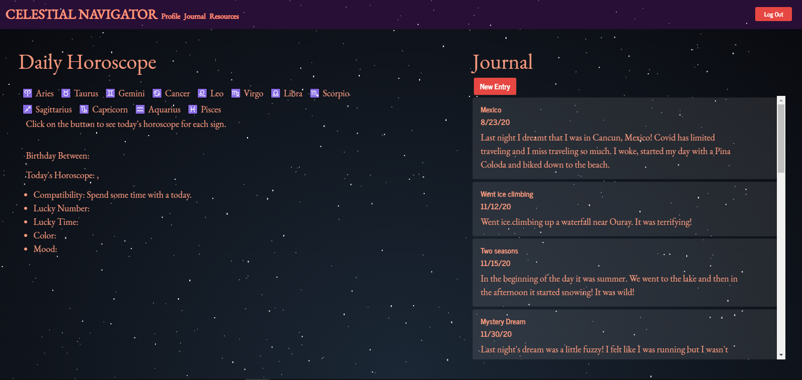
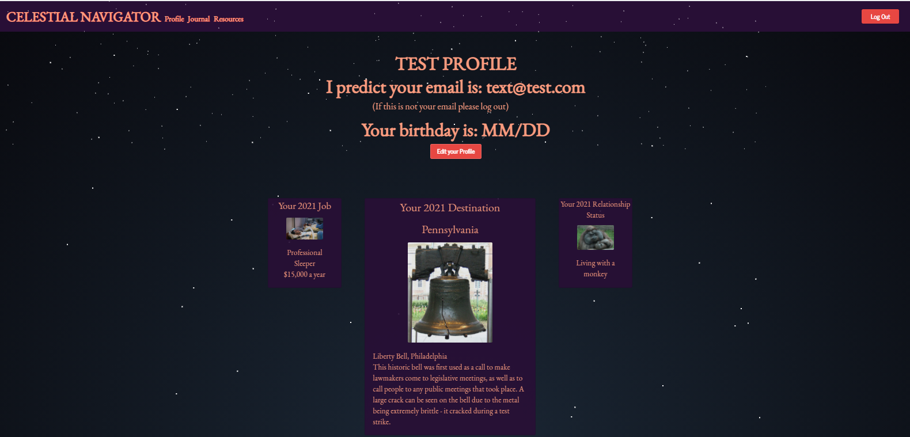
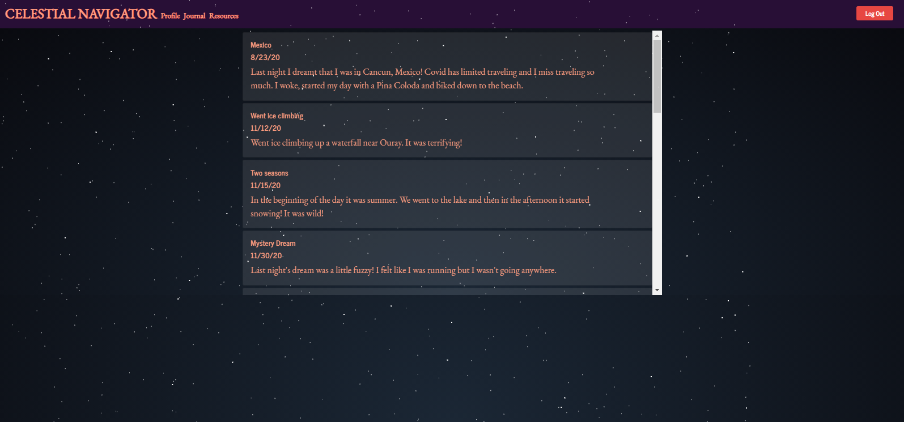
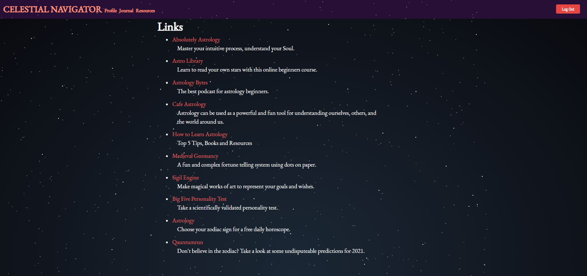

# Project 3 Celestial Navigator

## Info:

Search for your horoscope, enter your thoughts and feelings, find out your job, relationship status, and vacation destination for 2021 all on one site.

## Table of Contents

[Installation](#Installation) || [Usage](#Usage) || [License](#License) || [Contributing](#Contributing) || [Tests](#Tests) || [Questions](#Questions)

### Installation:

Application is hosted on heroku at https://arcane-lake-53566.herokuapp.com/profile

### Usage:

Select the Heroku link listed in the Installation section, above. In the Celestial Navigator log-in browser page, the user will select the button to log-in with their Google account or sign-up. Once signed-in, the Profile page will appear showing the user's future job, relationship status and vacation destination in 2021. Also on the Profile page, the user may chose to edit their profile by modifying their name and adding their birth month and date to refine their 2021 prediction. On the Home Page, Celestial Navigator, the user may view their daily horoscope, by selecting their zodiac sign, and view and post to their personal Journal. When the user selects the New Entry button, they can enter a new journal entry at the bottom of the page. In addition, the user may view their journal entries on the Journal page and find additional information on the Resources page.

#### Usage pics:

##### Profile:

##### Journal Entry:

##### Resources:

### License:

This project is licensed under the MIT license.

### Contributing:

Please contribute to enhance the functionality of this code with additional table types, like movies, games, etc. Please adhere to the Code of Conduct for the Contributer Covenant, version 2.0, at https://www.contributor-covenant.org/version/2/0/code_of_conduct.html.

### Questions:

To contact the authors of this repository, reach them via:

Mark Brazee
Github: https://github.com/MarkBrazee
Email: markbrazee@gmail.com

Travis Cook
Github: https://github.com/TravCook
Email: travismcook93@gmail.com

Madeline Cowell
Github: https://github.com/MadelineCowell
Email: madeline.cowell@colorado.edu

Brendon Hart
Github: https://github.com/hartbt
Email: brendonhartbusiness@gmail.com

Andy Ives
Github: https://github.com/andreaives
Email: andreasue3@gmail.com

Devon Phillips
Github: https://github.com/devonp702
Email: devon.p702@gmail.com
